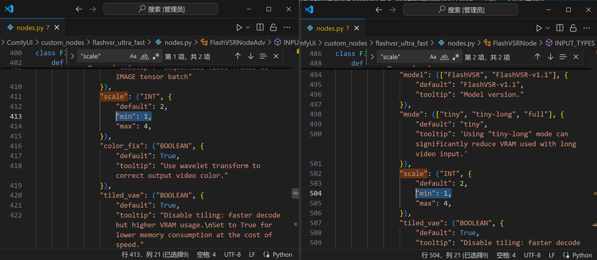
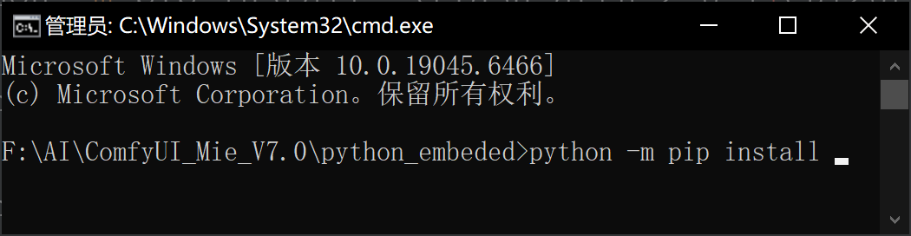
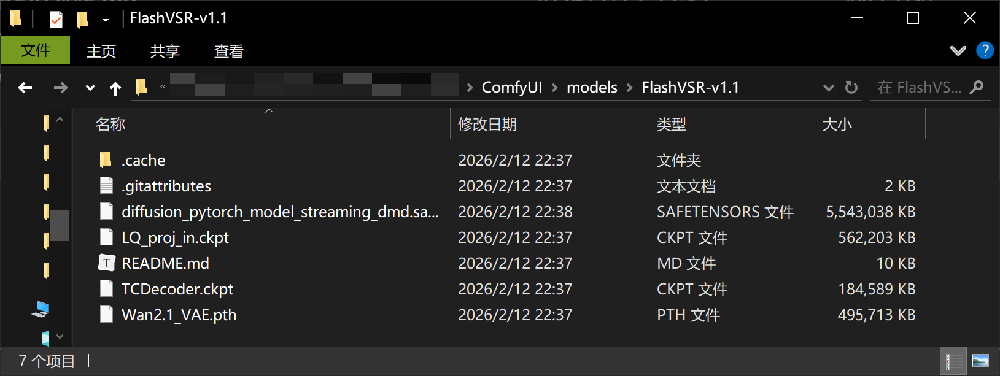
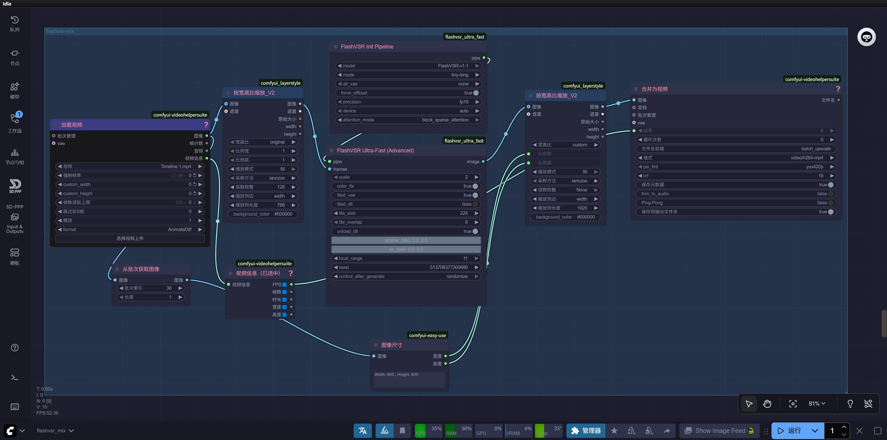
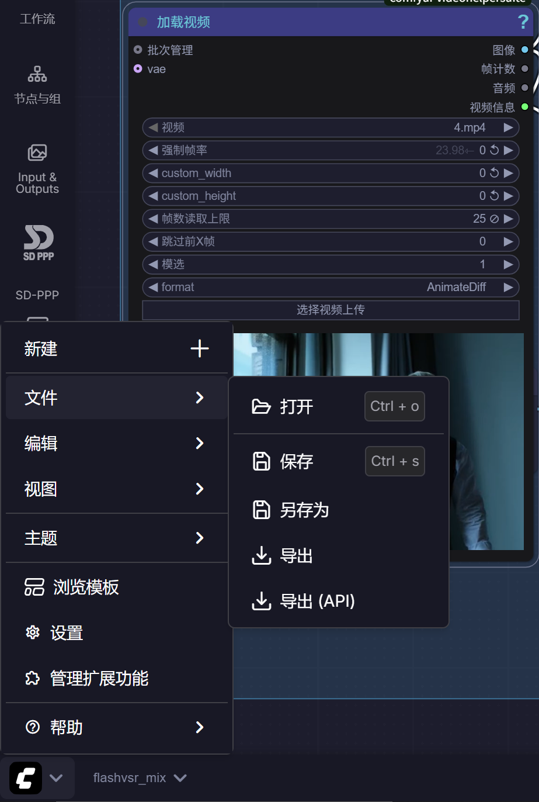
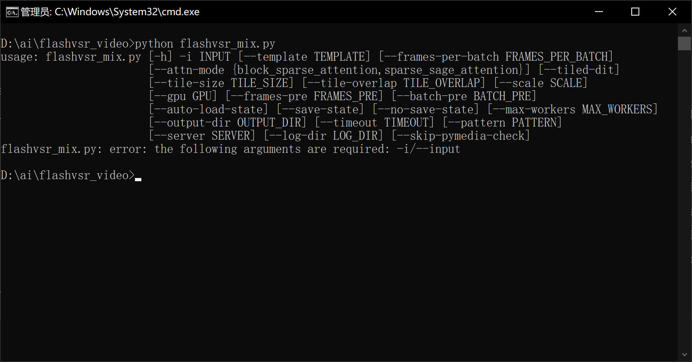
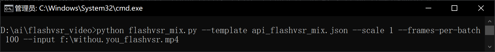
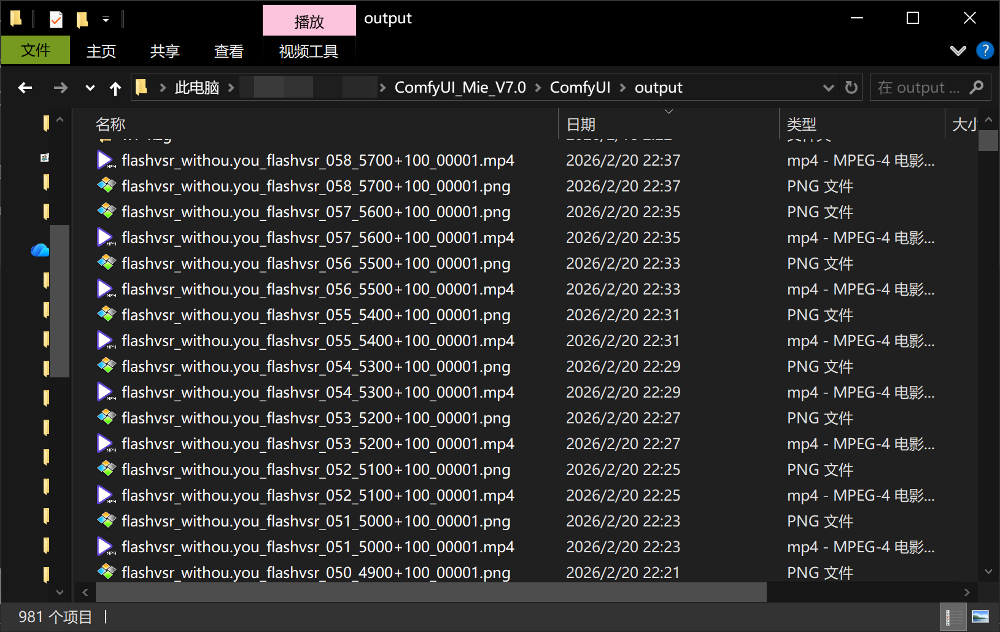

---
aliases:
tags:
author: 好奇心害死薛定谔的猫
date created: 2026-02-21 00:29
date modified: 2026-02-21 13:21
---

# flashvsr 在 comfyui 中应用

## 环境准备

安装 CUDA 12.8。
安装 ComfyUI，可以使用整合包比较方便，比如 B 站 UP 主离离原上咩或者秋叶 aki 的，确认 Python 3.12。

## 安装 flashvsr 相关节点和依赖库

安装节点

[lihaoyun6/ComfyUI-FlashVSR_Ultra_Fast: Real-Time Diffusion-Based Streaming Video Super-Resolution / 基于 Diffusion 架构的实时视频流超分模型](https://github.com/lihaoyun6/ComfyUI-FlashVSR_Ultra_Fast)

修改节点代码，使之支持 1 倍修复。
修改 `nodes.py` 中的 413 和 504 行，从 2 改为 1。


安装依赖

进入 comfyui 的 python 目录。进入 `{替换成你自己的comfyui根目录}\python_embeded`



```shell
python -m pip install torch==2.7.0 torchvision==0.22.0 torchaudio==2.7.0 --index-url https://download.pytorch.org/whl/cu128

# 轮子在此处下载 https://github.com/lihaoyun6/Block-Sparse-Attention/releases/tag/v0.0.1
# Nvidia 50系显卡可不安装
# 放到当前目录运行，或者自己改下实际路径。
python -m pip install .\block_sparse_attn-0.0.1+cu128torch2.7cxx11abiFALSE-cp312-cp312-win_amd64.whl
python -m pip install .\flash_attn-2.8.1+cu128torch2.7cxx11abiFALSE-cp312-cp312-win_amd64.whl

python -m pip install flash-attention --no-build-isolation

python -m pip install modelscope -i https://mirrors.aliyun.com/pypi/simple/
```

## 模型

### flashvsr-v1.1

镜像链接：  
[JunhaoZhuang/FlashVSR-v1.1 at main](https://hf-mirror.com/JunhaoZhuang/FlashVSR-v1.1/tree/main)

放到 comfyui 的 model 目录下。

`{替换成你自己的路径}\ComfyUI\models\FlashVSR-v1.1`



### vae

[Comfy-Org/Wan_2.2_ComfyUI_Repackaged at main](https://hf-mirror.com/Comfy-Org/Wan_2.2_ComfyUI_Repackaged/tree/main/split_files/vae)
`{替换成你自己的路径}\ComfyUI\models\vae\Wan_2.2\wan2.2_vae.safetensors`

## 工作流

将以下代码保存为 `flahvsr-mix.json` 文件，放到 `{替换成你自己的路径}\ComfyUI\users\default\workflows` 路径下。

```json
{"id":"c02fa9ca-4e2a-482a-bce0-45d21af8aa21","revision":0,"last_node_id":34,"last_link_id":43,"nodes":[{"id":21,"type":"ImageFromBatch","pos":[-10332.037845020597,582.3260346013175],"size":[210,82],"flags":{"collapsed":false},"order":2,"mode":0,"inputs":[{"label":"图像","localized_name":"图像","name":"image","type":"IMAGE","link":25},{"localized_name":"批次索引","name":"batch_index","type":"INT","widget":{"name":"batch_index"},"link":null},{"localized_name":"长度","name":"length","type":"INT","widget":{"name":"length"},"link":null}],"outputs":[{"label":"图像","localized_name":"图像","name":"IMAGE","type":"IMAGE","links":[24]}],"properties":{"cnr_id":"comfy-core","ver":"0.3.75","Node name for S&R":"ImageFromBatch","widget_ue_connectable":{}},"widgets_values":[38,1]},{"id":22,"type":"VHS_VideoInfoLoaded","pos":[-10030.48674091957,593.8389078291776],"size":[186,106],"flags":{"collapsed":false},"order":4,"mode":0,"inputs":[{"label":"视频信息","localized_name":"video_info","name":"video_info","type":"VHS_VIDEOINFO","link":26}],"outputs":[{"label":"FPS🟦","localized_name":"fps🟦","name":"fps🟦","type":"FLOAT","links":[42]},{"label":"帧数🟦","localized_name":"frame_count🟦","name":"frame_count🟦","type":"INT","links":[]},{"label":"时长🟦","localized_name":"duration🟦","name":"duration🟦","type":"FLOAT","links":[]},{"label":"宽度🟦","localized_name":"width🟦","name":"width🟦","type":"INT","links":[]},{"label":"高度🟦","localized_name":"height🟦","name":"height🟦","type":"INT","links":[]}],"properties":{"cnr_id":"comfyui-videohelpersuite","ver":"1.7.8","Node name for S&R":"VHS_VideoInfoLoaded"},"widgets_values":{}},{"id":20,"type":"easy imageSize","pos":[-9644.242784423812,784.5696477830178],"size":[210,108],"flags":{"collapsed":false},"order":5,"mode":0,"inputs":[{"label":"图像","localized_name":"图像","name":"image","type":"IMAGE","link":24}],"outputs":[{"label":"宽度","localized_name":"宽度","name":"width_int","type":"INT","links":[22]},{"label":"高度","localized_name":"高度","name":"height_int","type":"INT","links":[23]}],"properties":{"cnr_id":"comfyui-easy-use","ver":"1.3.4","Node name for S&R":"easy imageSize","widget_ue_connectable":{}},"widgets_values":["Width: 800 , Height: 600"]},{"id":34,"type":"VHS_VideoCombine","pos":[-8952.327956636696,103.25977773732329],"size":[563.2943630166619,334],"flags":{},"order":8,"mode":0,"inputs":[{"label":"图像","localized_name":"images","name":"images","type":"IMAGE","link":41},{"label":"音频","localized_name":"audio","name":"audio","shape":7,"type":"AUDIO","link":null},{"label":"批次管理","localized_name":"meta_batch","name":"meta_batch","shape":7,"type":"VHS_BatchManager","link":null},{"localized_name":"vae","name":"vae","shape":7,"type":"VAE","link":null},{"localized_name":"帧率","name":"frame_rate","type":"FLOAT","widget":{"name":"frame_rate"},"link":42},{"localized_name":"循环次数","name":"loop_count","type":"INT","widget":{"name":"loop_count"},"link":null},{"localized_name":"文件名前缀","name":"filename_prefix","type":"STRING","widget":{"name":"filename_prefix"},"link":null},{"localized_name":"格式","name":"format","type":"COMBO","widget":{"name":"format"},"link":null},{"localized_name":"Ping-Pong","name":"pingpong","type":"BOOLEAN","widget":{"name":"pingpong"},"link":null},{"localized_name":"保存到输出文件夹","name":"save_output","type":"BOOLEAN","widget":{"name":"save_output"},"link":null},{"name":"pix_fmt","type":["yuv420p","yuv420p10le"],"widget":{"name":"pix_fmt"},"link":null},{"name":"crf","type":"INT","widget":{"name":"crf"},"link":null},{"label":"保存元数据","localized_name":"保存元数据","name":"save_metadata","type":"BOOLEAN","widget":{"name":"save_metadata"},"link":null},{"name":"trim_to_audio","type":"BOOLEAN","widget":{"name":"trim_to_audio"},"link":null}],"outputs":[{"label":"文件名","localized_name":"Filenames","name":"Filenames","type":"VHS_FILENAMES","links":[]}],"properties":{"cnr_id":"comfyui-videohelpersuite","ver":"3234937ff5f3ca19068aaba5042771514de2429d","Node name for S&R":"VHS_VideoCombine"},"widgets_values":{"frame_rate":8,"loop_count":0,"filename_prefix":"batch_upscale","format":"video/h264-mp4","pix_fmt":"yuv420p","crf":19,"save_metadata":true,"trim_to_audio":false,"pingpong":false,"save_output":true,"videopreview":{"hidden":false,"paused":false,"params":{"filename":"batch_upscale_00004.mp4","subfolder":"","type":"output","format":"video/h264-mp4","frame_rate":25,"workflow":"batch_upscale_00004.png","fullpath":"/root/comfy/ComfyUI/output/batch_upscale_00004.mp4"}}}},{"id":25,"type":"VHS_LoadVideo","pos":[-10495.367613102837,198.3739583734827],"size":[426.0032958984375,310],"flags":{"collapsed":false},"order":0,"mode":0,"inputs":[{"label":"批次管理","localized_name":"meta_batch","name":"meta_batch","shape":7,"type":"VHS_BatchManager","link":null},{"label":"vae","localized_name":"vae","name":"vae","shape":7,"type":"VAE","link":null},{"localized_name":"视频","name":"video","type":"COMBO","widget":{"name":"video"},"link":null},{"localized_name":"强制帧率","name":"force_rate","type":"FLOAT","widget":{"name":"force_rate"},"link":null},{"localized_name":"custom_width","name":"custom_width","type":"INT","widget":{"name":"custom_width"},"link":null},{"localized_name":"custom_height","name":"custom_height","type":"INT","widget":{"name":"custom_height"},"link":null},{"localized_name":"帧数读取上限","name":"frame_load_cap","type":"INT","widget":{"name":"frame_load_cap"},"link":null},{"localized_name":"跳过前X帧","name":"skip_first_frames","type":"INT","widget":{"name":"skip_first_frames"},"link":null},{"localized_name":"模选","name":"select_every_nth","type":"INT","widget":{"name":"select_every_nth"},"link":null},{"localized_name":"format","name":"format","shape":7,"type":"COMBO","widget":{"name":"format"},"link":null}],"outputs":[{"label":"图像","localized_name":"图像","name":"IMAGE","type":"IMAGE","slot_index":0,"links":[25,34]},{"label":"帧计数","localized_name":"frame_count","name":"frame_count","type":"INT","slot_index":1,"links":[]},{"label":"音频","localized_name":"audio","name":"audio","type":"AUDIO","links":[]},{"label":"视频信息","localized_name":"video_info","name":"video_info","type":"VHS_VIDEOINFO","links":[26]}],"properties":{"cnr_id":"comfyui-videohelpersuite","ver":"3a96e87951f498ebcbb6d5bf685f6b0014c8f591","Node name for S&R":"VHS_LoadVideo","ue_properties":{"widget_ue_connectable":{"custom_height":true,"force_rate":true,"custom_width":true,"select_every_nth":true,"frame_load_cap":true,"format":true,"video":true,"skip_first_frames":true},"version":"7.0.1"},"widget_ue_connectable":{}},"widgets_values":{"video":"Timeline 1.mp4","force_rate":0,"custom_width":0,"custom_height":0,"frame_load_cap":0,"skip_first_frames":0,"select_every_nth":1,"format":"AnimateDiff","choose video to upload":"image","videopreview":{"paused":false,"hidden":false,"params":{"custom_height":480,"filename":"Timeline 1.mp4","force_rate":0,"custom_width":0,"select_every_nth":1,"frame_load_cap":0,"format":"video/mp4","skip_first_frames":0,"type":"input"}}},"color":"#3c3c83","bgcolor":"rgba(24,24,27,.9)"},{"id":29,"type":"FlashVSRInitPipe","pos":[-9738.626953546307,-58.410855612817784],"size":[418.89400622109815,215.34911779913296],"flags":{},"order":1,"mode":0,"inputs":[{"label":"model","localized_name":"model","name":"model","type":"COMBO","widget":{"name":"model"},"link":null},{"label":"mode","localized_name":"mode","name":"mode","type":"COMBO","widget":{"name":"mode"},"link":null},{"label":"alt_vae","localized_name":"alt_vae","name":"alt_vae","type":"COMBO","widget":{"name":"alt_vae"},"link":null},{"label":"force_offload","localized_name":"force_offload","name":"force_offload","type":"BOOLEAN","widget":{"name":"force_offload"},"link":null},{"label":"precision","localized_name":"precision","name":"precision","type":"COMBO","widget":{"name":"precision"},"link":null},{"label":"device","localized_name":"device","name":"device","type":"COMBO","widget":{"name":"device"},"link":null},{"label":"attention_mode","localized_name":"attention_mode","name":"attention_mode","type":"COMBO","widget":{"name":"attention_mode"},"link":null}],"outputs":[{"label":"pipe","localized_name":"pipe","name":"pipe","type":"PIPE","links":[35]}],"properties":{"aux_id":"lihaoyun6/ComfyUI-FlashVSR_Ultra_Fast","Node name for S&R":"FlashVSRInitPipe","cnr_id":"flashvsr_ultra_fast","ver":"9c4f26042c5d132903129909031c58cb36ca815e"},"widgets_values":["FlashVSR-v1.1","tiny-long","none",true,"fp16","auto","block_sparse_attention"]},{"id":28,"type":"FlashVSRNodeAdv","pos":[-9761.780345551851,266.9198658597777],"size":[427.40473930103474,398.663737790725],"flags":{},"order":6,"mode":0,"inputs":[{"label":"pipe","localized_name":"pipe","name":"pipe","type":"PIPE","link":35},{"label":"frames","localized_name":"frames","name":"frames","type":"IMAGE","link":36},{"label":"scale","localized_name":"scale","name":"scale","type":"INT","widget":{"name":"scale"},"link":null},{"label":"color_fix","localized_name":"color_fix","name":"color_fix","type":"BOOLEAN","widget":{"name":"color_fix"},"link":null},{"label":"tiled_vae","localized_name":"tiled_vae","name":"tiled_vae","type":"BOOLEAN","widget":{"name":"tiled_vae"},"link":null},{"label":"tiled_dit","localized_name":"tiled_dit","name":"tiled_dit","type":"BOOLEAN","widget":{"name":"tiled_dit"},"link":null},{"label":"tile_size","localized_name":"tile_size","name":"tile_size","type":"INT","widget":{"name":"tile_size"},"link":null},{"label":"tile_overlap","localized_name":"tile_overlap","name":"tile_overlap","type":"INT","widget":{"name":"tile_overlap"},"link":null},{"label":"unload_dit","localized_name":"unload_dit","name":"unload_dit","type":"BOOLEAN","widget":{"name":"unload_dit"},"link":null},{"label":"sparse_ratio","localized_name":"sparse_ratio","name":"sparse_ratio","type":"FLOAT","widget":{"name":"sparse_ratio"},"link":null},{"label":"kv_ratio","localized_name":"kv_ratio","name":"kv_ratio","type":"FLOAT","widget":{"name":"kv_ratio"},"link":null},{"label":"local_range","localized_name":"local_range","name":"local_range","type":"INT","widget":{"name":"local_range"},"link":null},{"label":"seed","localized_name":"seed","name":"seed","type":"INT","widget":{"name":"seed"},"link":null}],"outputs":[{"label":"image","localized_name":"image","name":"image","type":"IMAGE","links":[38]}],"properties":{"aux_id":"lihaoyun6/ComfyUI-FlashVSR_Ultra_Fast","Node name for S&R":"FlashVSRNodeAdv","cnr_id":"flashvsr_ultra_fast","ver":"9c4f26042c5d132903129909031c58cb36ca815e"},"widgets_values":[2,true,true,false,256,24,true,2,3,11,513708377300889,"randomize"]},{"id":26,"type":"LayerUtility: ImageScaleByAspectRatio V2","pos":[-10037.108483271388,113.44064352814713],"size":[216.034765625,330],"flags":{"collapsed":false},"order":3,"mode":0,"inputs":[{"label":"图像","localized_name":"image","name":"image","shape":7,"type":"IMAGE","link":34},{"label":"遮罩","localized_name":"mask","name":"mask","shape":7,"type":"MASK","link":null},{"localized_name":"宽高比","name":"aspect_ratio","type":"COMBO","widget":{"name":"aspect_ratio"},"link":null},{"localized_name":"比例宽","name":"proportional_width","type":"INT","widget":{"name":"proportional_width"},"link":null},{"localized_name":"比例高","name":"proportional_height","type":"INT","widget":{"name":"proportional_height"},"link":null},{"localized_name":"缩放模式","name":"fit","type":"COMBO","widget":{"name":"fit"},"link":null},{"localized_name":"采样方法","name":"method","type":"COMBO","widget":{"name":"method"},"link":null},{"localized_name":"倍数取整","name":"round_to_multiple","type":"COMBO","widget":{"name":"round_to_multiple"},"link":null},{"localized_name":"缩放到边","name":"scale_to_side","type":"COMBO","widget":{"name":"scale_to_side"},"link":null},{"localized_name":"缩放到长度","name":"scale_to_length","type":"INT","widget":{"name":"scale_to_length"},"link":null},{"localized_name":"background_color","name":"background_color","type":"STRING","widget":{"name":"background_color"},"link":null}],"outputs":[{"label":"图像","localized_name":"image","name":"image","type":"IMAGE","links":[36]},{"label":"遮罩","localized_name":"mask","name":"mask","type":"MASK","links":[]},{"label":"原始大小","localized_name":"original_size","name":"original_size","type":"BOX","links":[]},{"localized_name":"width","name":"width","type":"INT","links":[]},{"localized_name":"height","name":"height","type":"INT","links":[]}],"properties":{"cnr_id":"comfyui_layerstyle","ver":"90f4bfb38aaf121292f429b20eff07c6c121697e","Node name for S&R":"LayerUtility: ImageScaleByAspectRatio V2","widget_ue_connectable":{}},"widgets_values":["original",1,1,"fill","lanczos","128","width",768,"#000000"],"color":"rgba(38, 73, 116, 0.7)"},{"id":19,"type":"LayerUtility: ImageScaleByAspectRatio V2","pos":[-9232.702501953687,120.96511421098755],"size":[216.034765625,330],"flags":{"collapsed":false},"order":7,"mode":0,"inputs":[{"label":"图像","localized_name":"image","name":"image","shape":7,"type":"IMAGE","link":38},{"label":"遮罩","localized_name":"mask","name":"mask","shape":7,"type":"MASK","link":null},{"localized_name":"宽高比","name":"aspect_ratio","type":"COMBO","widget":{"name":"aspect_ratio"},"link":null},{"localized_name":"比例宽","name":"proportional_width","type":"INT","widget":{"name":"proportional_width"},"link":22},{"localized_name":"比例高","name":"proportional_height","type":"INT","widget":{"name":"proportional_height"},"link":23},{"localized_name":"缩放模式","name":"fit","type":"COMBO","widget":{"name":"fit"},"link":null},{"localized_name":"采样方法","name":"method","type":"COMBO","widget":{"name":"method"},"link":null},{"localized_name":"倍数取整","name":"round_to_multiple","type":"COMBO","widget":{"name":"round_to_multiple"},"link":null},{"localized_name":"缩放到边","name":"scale_to_side","type":"COMBO","widget":{"name":"scale_to_side"},"link":null},{"localized_name":"缩放到长度","name":"scale_to_length","type":"INT","widget":{"name":"scale_to_length"},"link":null},{"localized_name":"background_color","name":"background_color","type":"STRING","widget":{"name":"background_color"},"link":null}],"outputs":[{"label":"图像","localized_name":"image","name":"image","type":"IMAGE","links":[41]},{"label":"遮罩","localized_name":"mask","name":"mask","type":"MASK","links":[]},{"label":"原始大小","localized_name":"original_size","name":"original_size","type":"BOX","links":[]},{"localized_name":"width","name":"width","type":"INT","links":[]},{"localized_name":"height","name":"height","type":"INT","links":[]}],"properties":{"cnr_id":"comfyui_layerstyle","ver":"1.0.90","Node name for S&R":"LayerUtility: ImageScaleByAspectRatio V2","widget_ue_connectable":{"proportional_height":true,"proportional_width":true,"scale_to_length":true}},"widgets_values":["custom",352,272,"fill","lanczos","None","width",1920,"#000000"],"color":"rgba(38, 73, 116, 0.7)"}],"links":[[22,20,0,19,3,"INT"],[23,20,1,19,4,"INT"],[24,21,0,20,0,"IMAGE"],[25,25,0,21,0,"IMAGE"],[26,25,3,22,0,"VHS_VIDEOINFO"],[34,25,0,26,0,"IMAGE"],[35,29,0,28,0,"PIPE"],[36,26,0,28,1,"IMAGE"],[38,28,0,19,0,"IMAGE"],[41,19,0,34,0,"IMAGE"],[42,22,0,34,4,"FLOAT"]],"groups":[{"id":3,"title":"flashvsr-mix","bounding":[-10502.722222085777,-400.9727719363904,2193.3450199351764,1417.3417022336969],"color":"#3f789e","font_size":14,"flags":{}}],"config":{},"extra":{"ds":{"scale":1.083470594338857,"offset":[10136.372416317978,115.4264363711619]}},"version":0.4}
```



## 批量增强视频

使用工作流 API 方式来实现不限时长视频和多个视频增强。

### API 模板文件

[flashvsr_video/api_flashvsr_mix.json at main · OHLIA/flashvsr_video](https://github.com/OHLIA/flashvsr_video/blob/main/api_flashvsr_mix.json)

可能不同电脑上节点 ID 不一样，大家也可以自己导出 API 模板文件，按着修改。




### 脚本

[flashvsr_video/api_flashvsr_mix.json at main · OHLIA/flashvsr_video](https://github.com/OHLIA/flashvsr_video/blob/main/api_flashvsr_mix.json)

脚本使用



```shell
D:\ai\flashvsr_video>python flashvsr_mix.py
usage: flashvsr_mix.py [-h] -i INPUT [--template TEMPLATE] [--frames-per-batch FRAMES_PER_BATCH]
                       [--attn-mode {block_sparse_attention,sparse_sage_attention}] [--tiled-dit]
                       [--tile-size TILE_SIZE] [--tile-overlap TILE_OVERLAP] [--scale SCALE]
                       [--gpu GPU] [--frames-pre FRAMES_PRE] [--batch-pre BATCH_PRE]
                       [--auto-load-state] [--save-state] [--no-save-state] [--max-workers MAX_WORKERS]
                       [--output-dir OUTPUT_DIR] [--timeout TIMEOUT] [--pattern PATTERN]
                       [--server SERVER] [--log-dir LOG_DIR] [--skip-pymedia-check]
flashvsr_mix.py: error: the following arguments are required: -i/--input
```

解释参数

```shell
[-h] #帮助文档。

[--template TEMPLATE] #api范本文件，默认 api-flashvsr-mix.json
[--attn-mode {block_sparse_attention,sparse_sage_attention}] #可选。稀疏方式。50系设置 sparse_sage_attention，其他显卡默认，不用设置。
[--scale SCALE] #增强倍数。默认2倍。

[--INPUT [file or dir] ] #必填。输入文件或者目录。
[--output-dir OUTPUT_DIR] #可选，输出文件夹，默认 comfyui 自身的 output 文件夹。需要降低 comfyui安全等级才能成功设置，不然文件不输出，非必须不要设置。
[--pattern PATTERN] #可选。默认文件名前缀为 flashvsr_ 。

[--frames-per-batch FRAMES_PER_BATCH] #可选。每次跑的帧数，也就是切片帧数。不设置则整个视频跑。举例，增强到1080P，150帧，需要 32G 内存 33.3G 显存占用。
[--frames-pre FRAMES_PRE] #可选。已经处理过的帧数。。
[--batch-pre BATCH_PRE] #可选。已经处理的批次，方便区分切片顺序。


[--tiled-dit] #可选。将画面切块增强，降低显存使用，但是处理时间边长。
[--tile-size TILE_SIZE]#可选。搭配--tiled-dit使用。分块大小，需要为 32 的倍数。
[--tile-overlap TILE_OVERLAP] #可选。搭配--tiled-dit，--tile-size使用。分块重叠大小，需要为 8 的倍数。

[--timeout TIMEOUT] #可选。每批次超时时间，默认600秒。如果是分块处理，请自行设置更长时间。

[--gpu GPU] #可选。设置使用的 GPU 。默认第一张 CUDA 设备。
[--max-workers MAX_WORKERS] #可选。并发工作。默认1.

[--auto-load-state] #可选。读取上次状态，方便断点继续。
[--save-state] #可选。默认保存此次状态，方便断点继续。
[--no-save-state] #可选。不保存状态。
[--log-dir LOG_DIR] #可选。设置日志文件路径。默认为当前运行路径。

[--server SERVER] #可选。api 地址，默认 http://127.0.0.1:8188。
[--skip-pymedia-check] #可选。跳过 pymedia，改用 ffmpeg 获取文件帧率等基础信息。
```

### 实例

使用 1 倍修复，也就是只增强画质，不超分。



默认输出文件按切片帧数切块，无音频。
文件名格式默认 `flashvsr_源文件名_批次_起始帧数+当前文件帧数_序号.mp4`。



最后使用 mkvtoolnix 合并多个视频和原音频。
## 其他辅助工具

### 内存清理工具 MemReduct

[Download – Mem Reduct Download and Install](https://memreduct.org/mem-reduct-download/)
按使用率和时间来清理内存，跑 flashvsr 有内存泄漏的问题。

### MKVTOOLnix

[MKVToolNix Downloads – Matroska tools for Linux/Unix and Windows](https://mkvtoolnix.download/downloads.html#windows)
用以合并视频和音频。

### 视频对比工具 Video Compare GUI

[TetzkatLipHoka/VideoCompareGUI: GUI for the Video-Compare Tool](https://github.com/TetzkatLipHoka/VideoCompareGUI)

---

## 参考资料

[flashvsr 视频高清之路-工作流及教程](https://www.bilibili.com/video/BV1FwBjB6Eqk/?spm_id_from=333.1387.upload.video_card.click)

[FlashVSR-1.1 视高清放大，Block-Sparse-Attention 安装，ComfyUI-FlashVSR_Ultra_Fast](<[FlashVSR-1.1视高清放大，Block-Sparse-Attention安装，ComfyUI-FlashVSR_Ultra_Fast_哔哩哔哩_bilibili](https://www.bilibili.com/video/BV1tRk2BnELe/?spm_id_from=333.1387.search.video_card.click&vd_source=2d78d4a65cda078120c2095d8b0592a3)>)

[不限视频帧数，视频本地 4 倍高清放大，基于*FlashVSR*](https://www.bilibili.com/video/BV1udZVBvExi/?spm_id_from=333.1387.search.video_card.click)

[顶级的视频高清放大工具 FlashVSR | aibyte](https://www.aileading.cn/docs/tools/flash-vsr.html)

[GitHub - OpenImagingLab/FlashVSR: Towards Real-Time Diffusion-Based Streaming Video Super-Resolution — An efficient one-step diffusion framework for streaming VSR with locality-constrained sparse attention and a tiny conditional decoder.](https://github.com/OpenImagingLab/FlashVSR#)
